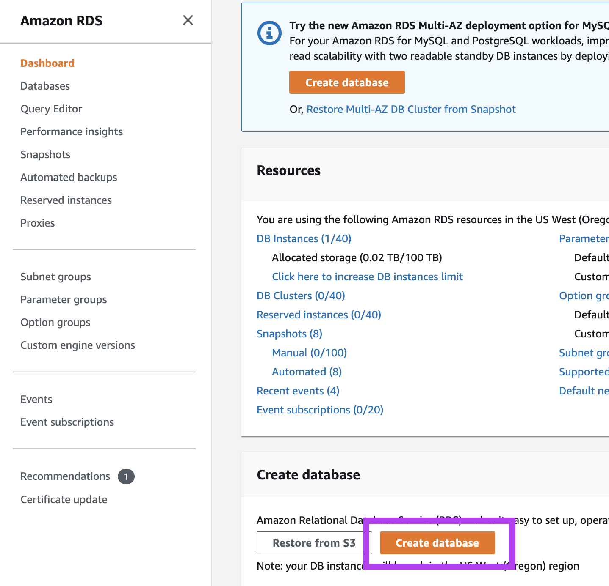
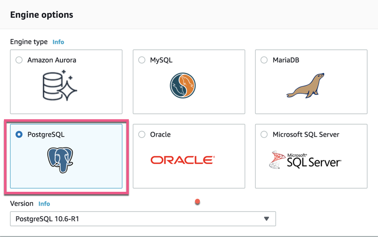
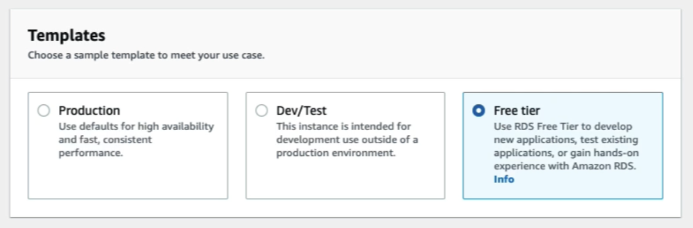
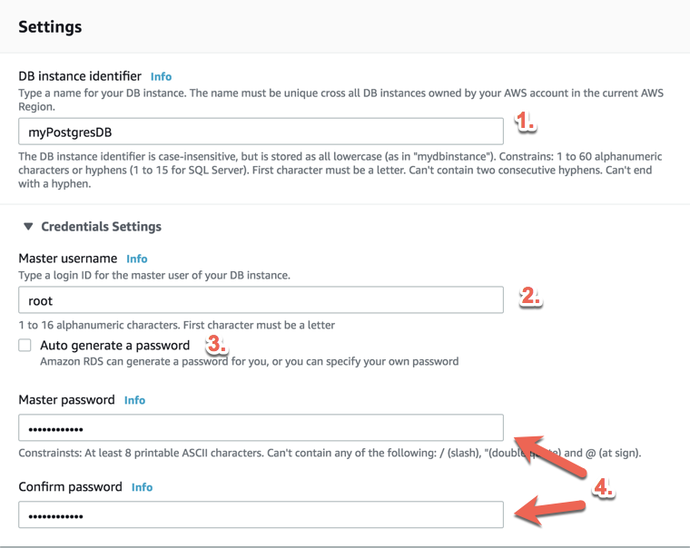
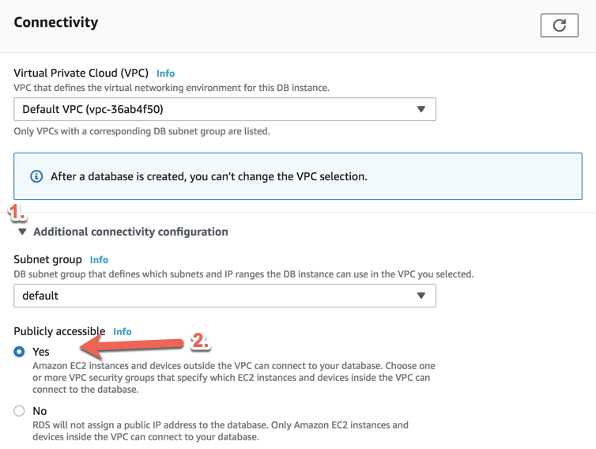
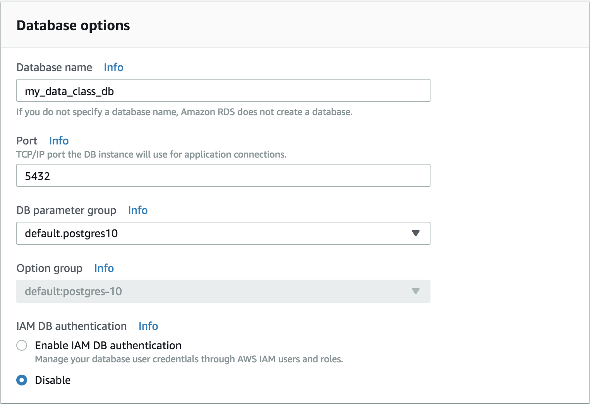
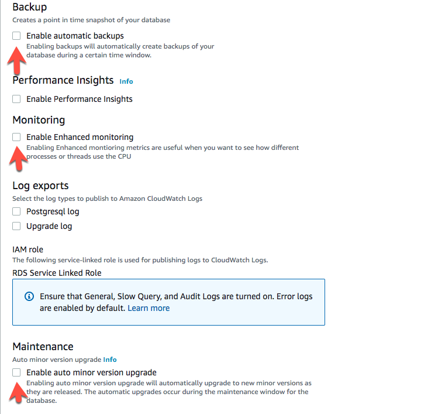

# Creating a PostgreSQL Database in AWS RDS

* **Important:** Review the disclaimer for [AWS Free Tier](Activities/00-AWS_Free_Tier/AWS-Free-Tier.pdf) services documentation to avoid accidentally incurring charges.

 * Log in to the AWS Management Console and navigate to the RDS section under Database.

  

  * Click the “Create database” button from the “Create database” section. The “Engine options” page displays a menu of different relational databases. **Note:** If you have accessed the service previously, AWS may present a different screen than the one depicted in the following image.

  

  **Note:** There may be an option to create a database with Amazon RDS Multi-AZ or Amazon Aurora, which is a paid database. We will not use these options.

* Check the box next to "Only enable options eligible for RDS Free Usage Tier" at the bottom of the menu.

* Select PostgreSQL.

  

* Select the "Free tier" template.

  

* Fill out the fields in the Settings section. Use myPostgresDB as the database instance identifier and root as the master username.

  **Note**: While the database instance identifier and master username can be anything, we recommend keeping these settings for consistency.

* Uncheck the Auto generate password box. Enter a password and be sure to record it somewhere and keep it safe. The other settings will be accessible in the future, but the password will not.

  

* Under "Connectivity", click the down arrow next to Additional connectivity configuration. Select Yes for the “Public accessibility” option. Explain that this setting does not mean that anyone can access the database. The database is still password-protected, but connections from outside sources like pgAdmin are permitted.

  

* Under Additional configuration, click the down arrow and name the database “my_data_class_db”. Keep the default settings in the other fields.

  

* Uncheck the boxes for “Enable automatic backups,” “Enable performance insights,” and “Enable auto minor version upgrade.”

  

* Leave everything else as is.

* **Reminder:** We selected AWS Free Tier to avoid charges, and will need clean up the database at the end of class to make sure nothing is left running.

* Finally, click Create Database followed by View DB Instance details to navigate to the instance console page. Database creation will take anywhere from 10 to 15 minutes.

---

© 2022 edX Boot Camps LLC. Confidential and Proprietary. All Rights Reserved.
