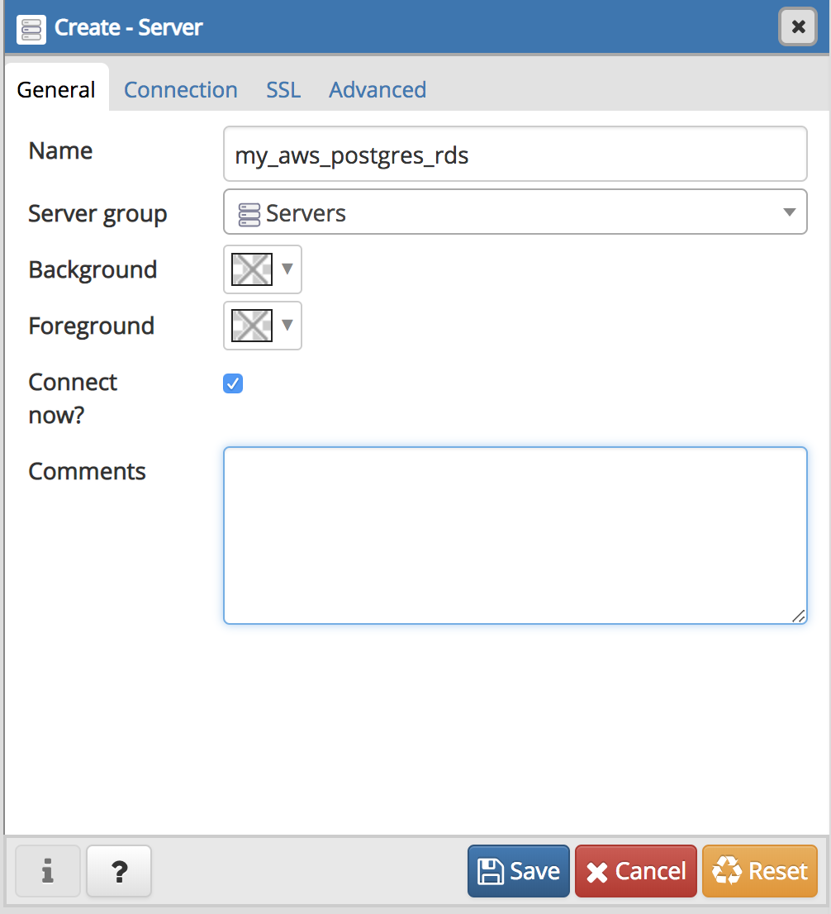

# RDS, PostgreSQL, and pgAdmin

* Log in to the AWS console and navigate to RDS.

  

* Navigate to "DB Instances" in the "Resources" section.

  

* Go to the database created earlier named `mypostgresdb`.

* From your database page, scroll down to the connectivity and security section.

* Locate the "Security" header and make note of the note of the "ID", which begins with "SG" followed by a set of numbers.

* Click the link contained in this security group number, which will take you to the Security Groups page.

* On this page, locate the security group ID noted previously and click the link. The resulting page represents security group settings for this specific ID.

* Explain the following details:

  * The security groups tell the RDS instance which traffic is allowed into and out of the database.

  * The security settings can range from restrictive to open.

  * In this activity, the database will be open to all traffic. This is NOT recommended for a production environment.

* Navigate to the "Inbound Rules" section and click the "Edit Inbound Rules" button. Leave the first rule as is, then click to "Add Rule".

* From the resulting drop down menus, change "Type" to "Postgres" and "Source" to "Anywhere IPv4", then click "Save Rules" which will save and return you to the security group settings page.

* Navigate now to the "Outbound Rules" section and click the "Edith Outound Rules" button. Change the "Destination" drop down menu selection to "Anywhere IPv4", then click save rules which will again return you to the security group settings page.

* Navigate back to your database instance console. Ask the class to find the endpoint, which is located on the "Connectivity & Security" tab. Once they locate the endpoint, copy it to your clipboard.

  )

* Open up pgAdmin, right-click on Servers, and then go to Create - Server. Go through the following steps to create a connection to the AWS RDS instance.

  * On the General tab, enter the server name as **my_aws_postgres_rds**.

    

  * On the Connection tab, perform the following steps:

    * Paste the Endpoint in the Hostname/address field. This is unique to the instance.

    * Type postgres in the "Maintenance database" field. This is the default for all postgres RDS instances.

    * Enter the Username in the Username field, which in our case is `root`.

    * Enter the password that you created for your RDS instance.

    * Check the box next to Save Password.

  * Click the Save button. If all information has been entered correctly, AWS will set up the connection (and not return an error message).

    .

---

© 2022 edX Boot Camps LLC. Confidential and Proprietary. All Rights Reserved.
