# Cloud Storage on S3

 * Go to console.aws.amazon.com and then select S3 under Storage.

    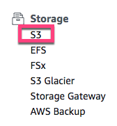

  * Click "Create bucket".

    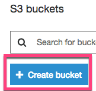

  * Create a bucket name and choose the region.

  * **Note:** The bucket name must be unique across all existing bucket names in Amazon S3. Buckets cannot be renamed or created inside of another bucket.

  * Leave the region as the default `US East (N. Virginia)`. Changing the region will change the object URL used in all examples today.

    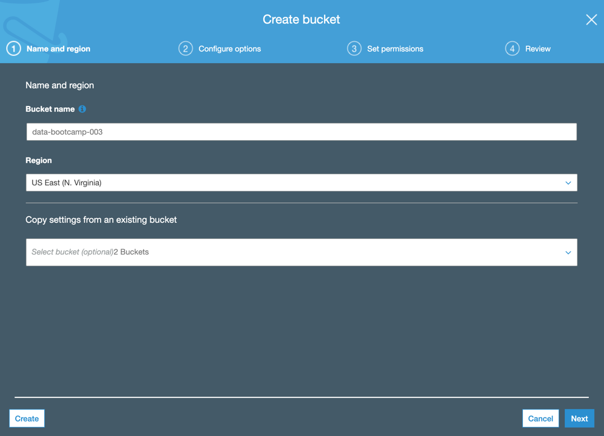

  * Most of the options on the Configure Options tab can stay as the default values.

  * Tags are user-defined key-value pairs of information that can help keep track of buckets.

  * Click Next.

    

  * The Set Permissions page allows us to grant permissions for accessing buckets.

  * Many [security breaches](https://businessinsights.bitdefender.com/worst-amazon-breaches) have been the result of unsecured S3 buckets.

  * Public access is denied by default.

    * Leave the boxes checked and click Next.

    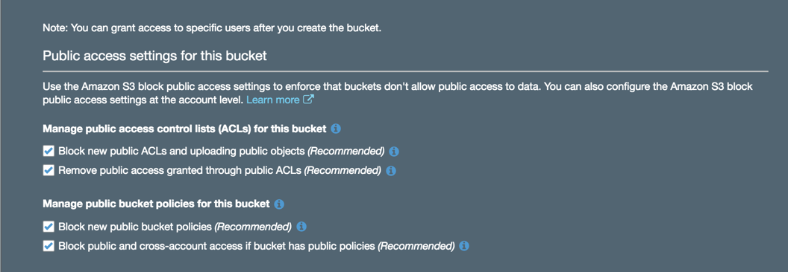

  * The Review page is a summary of the bucket configurations. Click "Create bucket." The bucket name now appears in the S3 console.

    

    

* We'll now upload an image file to the newly created bucket. Click the bucket name and then click Upload.

  * You can drag a file to the screen to upload it..

 * Click Upload.

    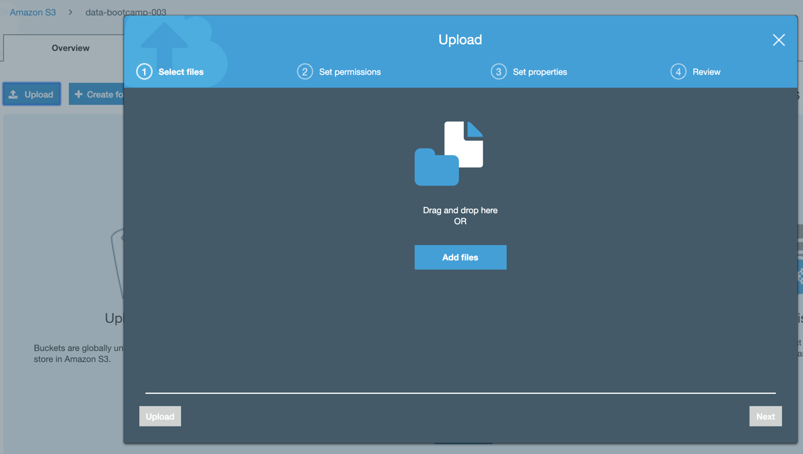

    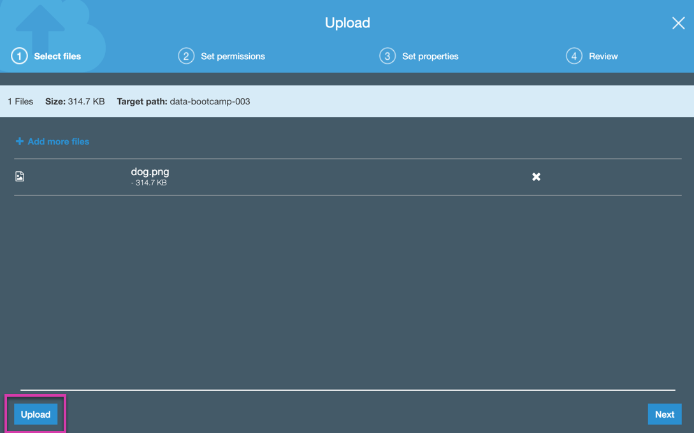

  * Click the filename.

    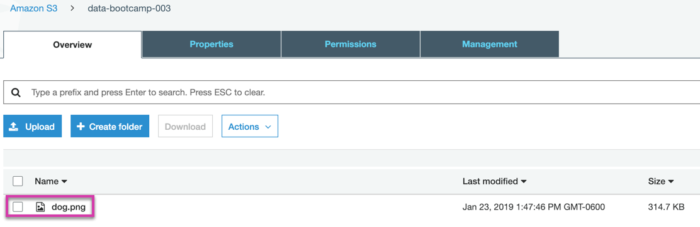

  * Explain why clicking the link generates an error message.

    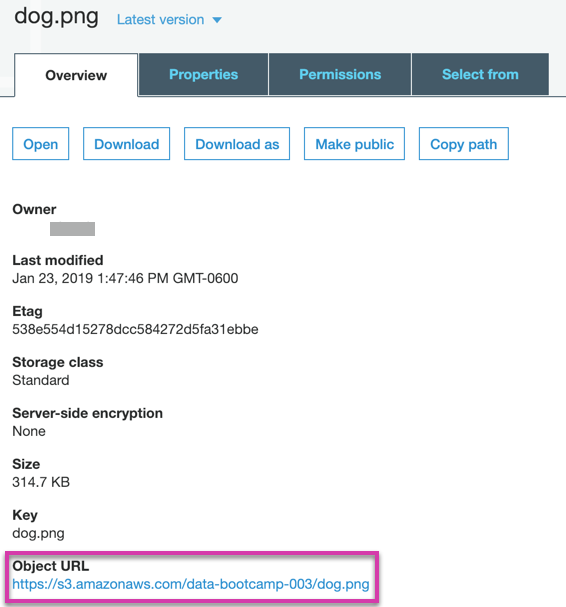

    

  * By default, the permission for the file denies access to everyone, so you need to change it.

  * Navigate back to the dashboard by clicking Amazon S3 on the top left.

    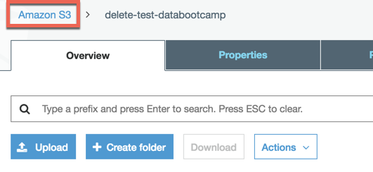

  * Check the box next to your bucket and click "Edit public access settings."

    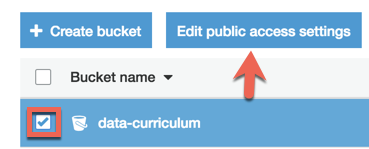

  * Make sure all boxes are unchecked on the next screen. Even though these were checked in the initial setup, they should not be now.

    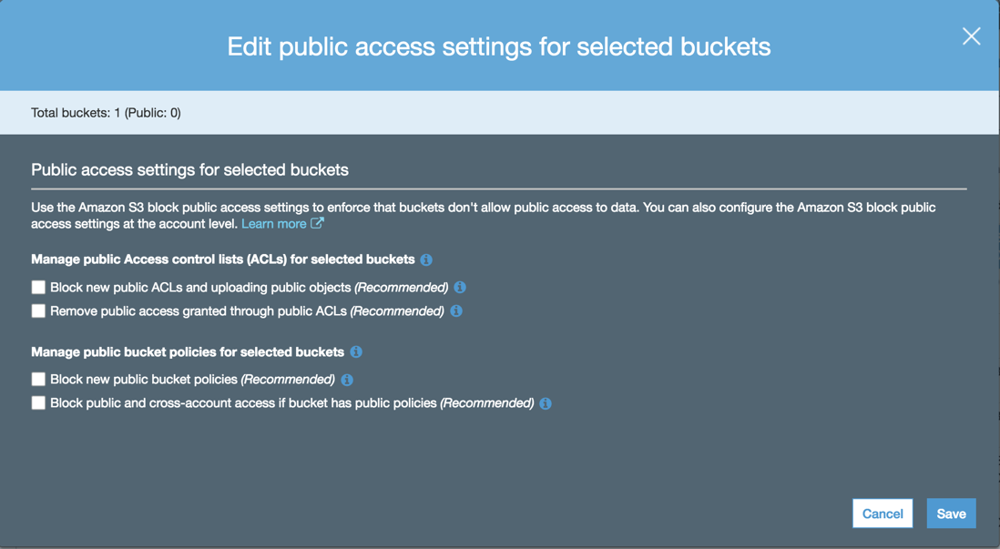

  * Click Save, then type "confirm" and click the Confirm button.

    

  * Next, navigate back into your bucket and check the box next to the image. Click the Actions box and select "Make public".

    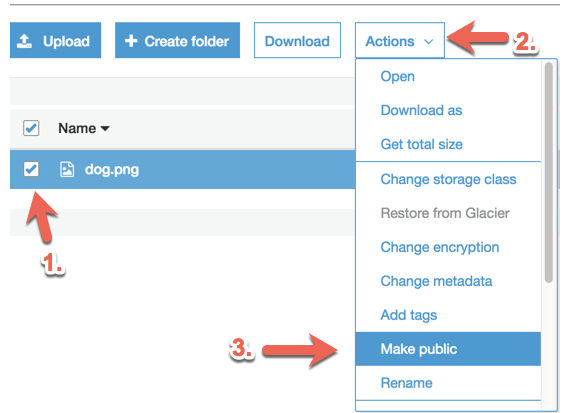

  * Now the image will be displayed when you click on the link.

* You can explore various settings at the bucket level and the file level. Use the tabs at the bucket level to explore the available settings, such as tags:

  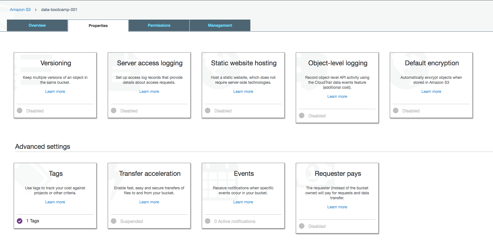

* **Note:** You can remove public access at any time by repeating the preceding steps and checking all the boxes in Edit public access settings.

---

© 2022 edX Boot Camps LLC. Confidential and Proprietary. All Rights Reserved.
