# Getting Started with Databricks Community Edition

This guide reviews the steps for creating a Databricks Community Edition account and using Databricks.

## Create an Account

1. Go to the [Databricks Community Edition site](https://community.cloud.databricks.com/login.html) and click “Sign Up”.
    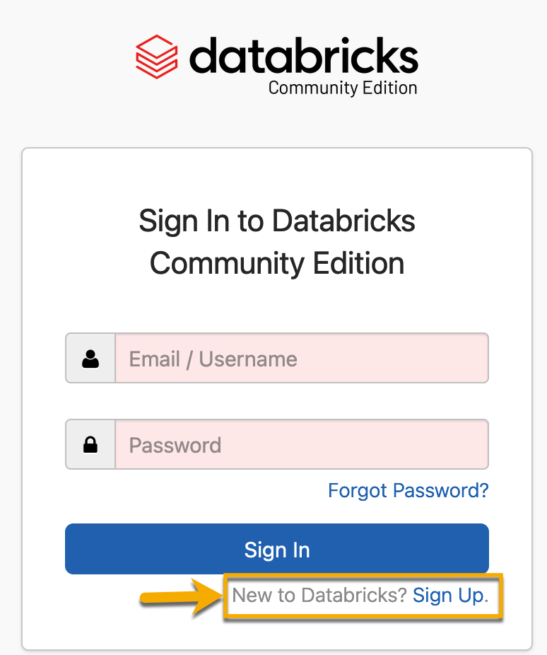

2. On the next page, fill out the required information and click "Get Started For Free."

    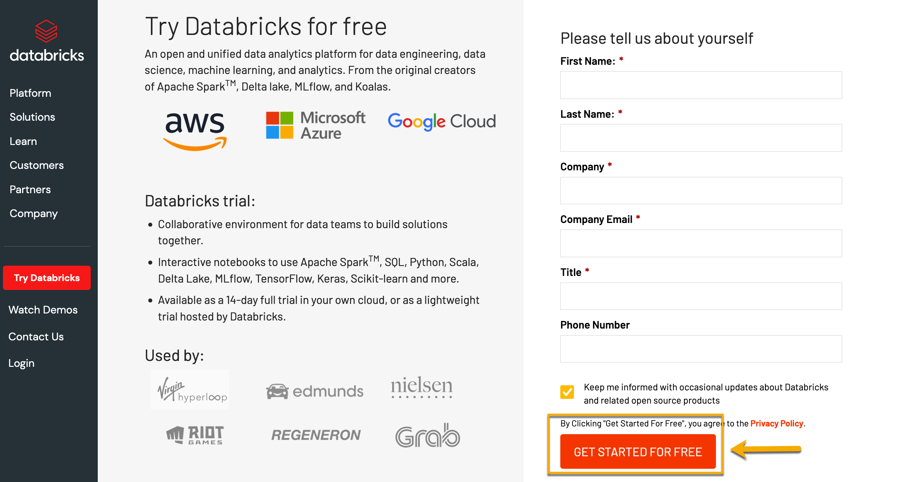

3. You will be redirected to sign up for the standard Databricks account. Do NOT click any of the cloud provider options. To use the Community Edition, click "Get started with Community Edition."

    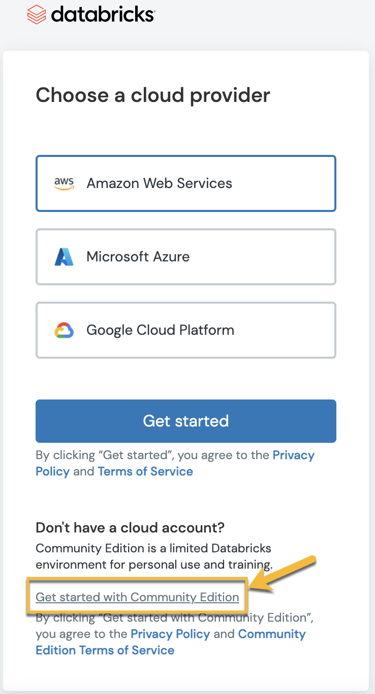

4. Follow the onscreen prompts to verify your account.

    

5. When prompted, check your email and click the link to verify your account and reset your password. Once you reset your password, you can log into the Community Edition.
    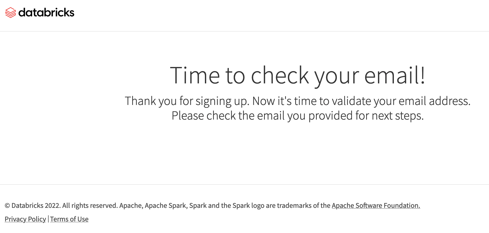

    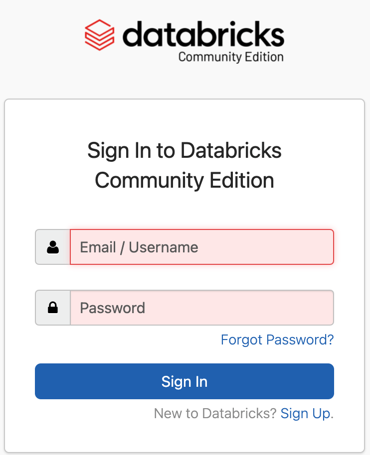

## Navigate the Community Edition

When you log into your Databricks Community Edition account, you'll see the Data Science and Engineering landing page:

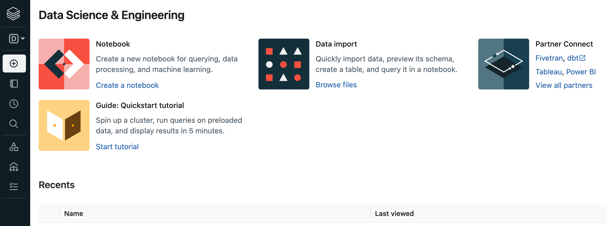

On the landing page, you can choose from four options:

1. A quickstart tutorial to help you create a cluster, attach a notebook to your cluster, create a table for a dataset, query the table using SQL, create a table and a graph, and create a DataFrame.

2. Create a new notebook, such as a Jupyter notebook.

3. Import data.

4. Connect to external software, like Tableau, Power BI, and more. **Note:** The Community Edition does not allow connections to external software.

You can use the quickstart tutorial to familiarize yourself Databricks, or proceed to the following steps to start using Databricks.

## Using Databricks

Follow these steps to get started using Databricks.

1. Before you create a notebook, you have to create a cluster. On the navigation pane on the left side of the landing page, click "+" and select Cluster.

    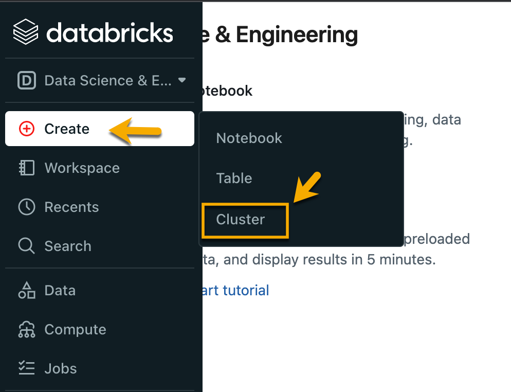

2. Use the default runtime settings, `9.1 LTS (Scala 2.12, Spark 3.1.2)`, or select an alternate version.

    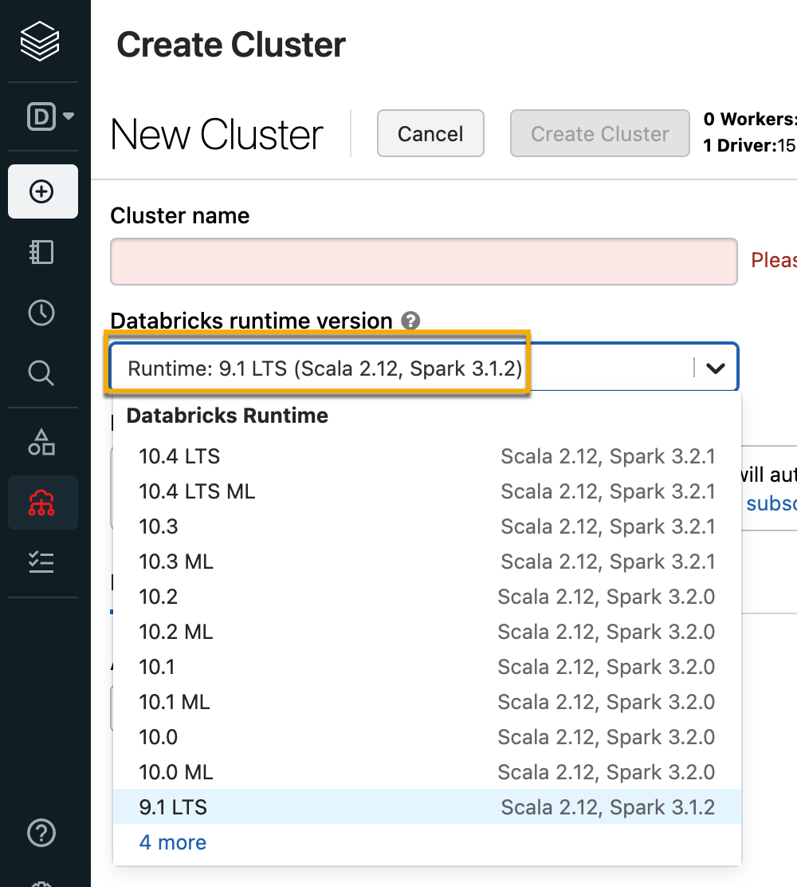

3. Enter a name for your cluster.

    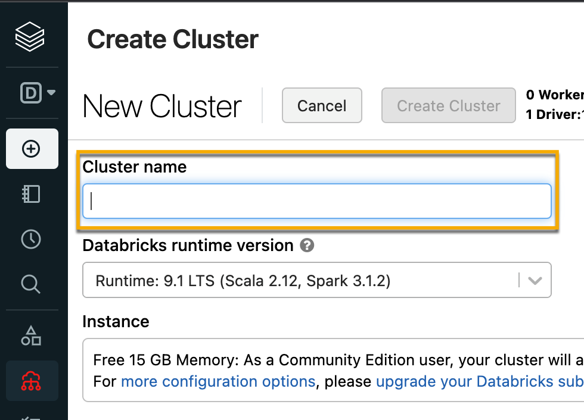

4. Click the "Create Cluster" button at the top of the "Create Cluster" page.

    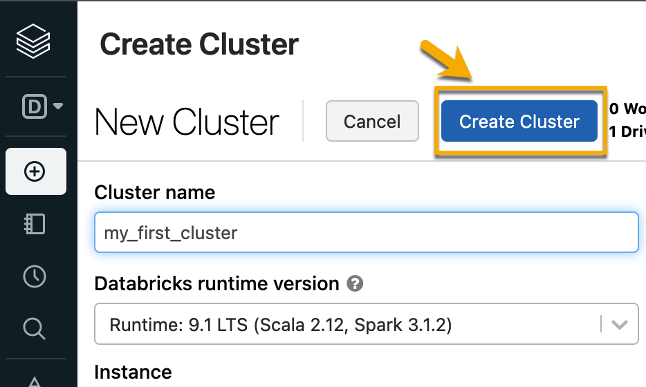

5. After clicking "Create Cluster", a progress circle icon will spin while the cluster is being created. This may take a few minutes.

    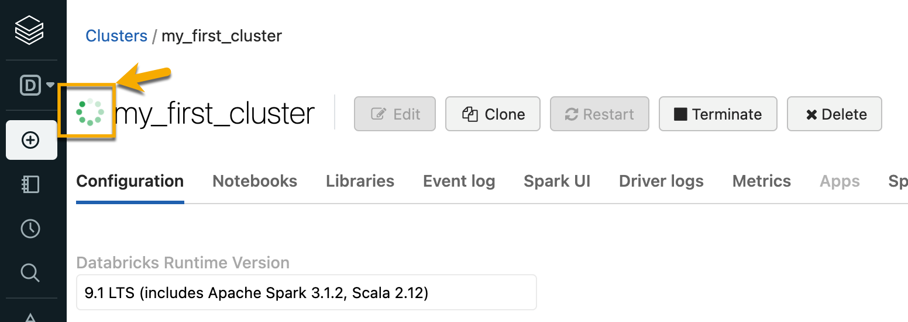

You’re now ready to use Databricks!

---

© 2022 edX Boot Camps LLC. Confidential and Proprietary. All Rights Reserved.
